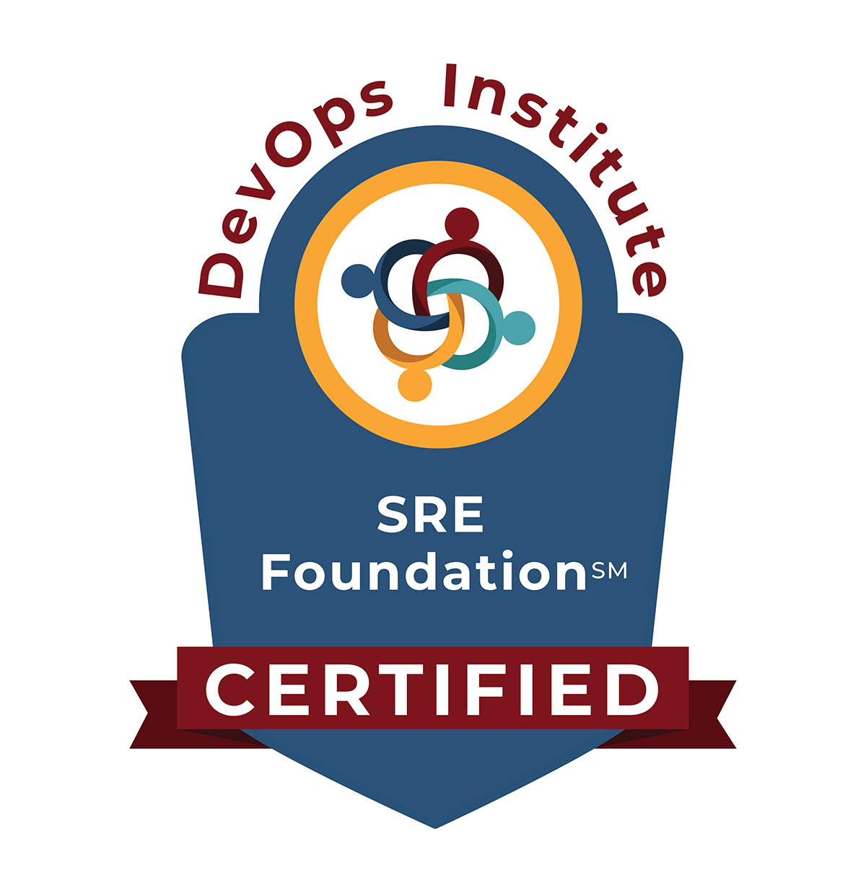

<h1 align="left">Hi 👋, I'm Grucci</h1>
- 🔭 I’m currently working on Bradesco Bank with Cloud Infrastructure Engineering

  ##

 

  <a href="https://github.com/Grucci">
  
  

### Technologies & Tools

  
  
  
  
  
  
  
  

 

### Badges

  
  
  
  
  
  

  ##

  
  
  
  
  

  
<!-- 
  
  

--!>
